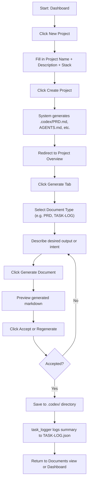

# Architecture Document

This file outlines the technical architecture, schema conventions, input/output formats, and best practices for the TechCat Studio project.

---

## 🧱 System Overview

TechCat Studio is a modular, agent-augmented developer tool that generates and evolves project infrastructure files in the `.codex/` directory. It combines a Next.js frontend, optional FastAPI backend, OpenAI API integration, and markdown-based versioning to streamline AI-native software development workflows, with heavy support for OpenAI Codex-based agents.

---

## 📦 Directory Structure (Simplified)

```
/
├── apps/                          # Top-level apps in the monorepo
│   ├── doc-gen-api/               # (Future) API service for document generation
│   ├── feedback-processor/        # (Future) Agent for handling feedback orchestration
│   └── techcat-studio/            # Main Next.js frontend app
│       ├── public/                # Static assets and favicons
│       ├── src/                   # Source code
│       │   ├── app/               # App Router pages and layouts
│       │   │   ├── dashboard/     # User KPIs and summaries
│       │   │   ├── documents/     # Markdown preview and editing
│       │   │   ├── feedback/      # Feedback submission form
│       │   │   ├── generate/      # Document generation interface
│       │   │   ├── projects/      # Project management and creation
│       │   │   │   └── new/       # New project form page
│       │   │   ├── settings/      # Preferences and config
│       │   │   ├── layout.tsx     # Root layout wrapper
│       │   │   └── page.tsx       # Redirect or default landing
│       │   ├── components/        # All React components (modularized)
│       │   │   ├── ui/            # ShadCN & Tailwind-based design primitives
│       │   │   ├── common/        # Cross-cutting components (e.g. Header)
│       │   │   ├── docs/          # Document-related components
│       │   │   └── projects/      # Components for projects & creation
│       │   ├── context/           # React context providers
│       │   ├── hooks/             # Custom React hooks (e.g. useTasks)
│       │   ├── lib/               # Utility helpers, date/time, etc.
│       │   ├── services/          # API clients (e.g. Codex, Airtable)
│       │   ├── styles/            # Tailwind config and globals
│       │   └── types/             # Domain types and enums
│       ├── package.json
│       ├── tsconfig.json
│       ├── next.config.ts
│       └── README.md
├── packages/                      # Shared packages for future scale
│   ├── ui/                        # Shared UI primitives (optional)
│   └── utils/                     # Shared logic or validation schemas
├── .codex/                        # AI agent infrastructure files
│   ├── AGENTS.md
│   ├── ARCHITECTURE.md
│   ├── PRD.md
│   ├── TASK-LOG.json
│   ├── PROPOSED-TASKS.md
│   └── prompts/                   # Prompt templates per agent
├── README.md
```

---

## 🧱 Codex Infrastructure Files Explained

- `AGENTS.md`: Agent roster and prompt responsibilities
- `PRD.md`: Product vision, scope, and goals
- `TASK-LOG.json`: Completed tasks (append-only history)
- `PROPOSED-TASKS.md`: Future or suggested system-generated work
- `ARCHITECTURE.md`: Technical implementation guide and prompt interface contract

---

## 🤖 Agent I/O Conventions

All agents work with markdown-based I/O and follow deterministic, modular prompt execution principles.

### Key Conventions
- Markdown format required
- Output should target a single `.codex/` file
- Task Metadata must include agent, task id, date, summary, and output files

### Example: `TASK-LOG.json` Entry
```json
{
  "task_id": "task-999",
  "agent": "frontend_specialist",
  "date": "2025-06-25",
  "summary": "Added support for generating JSON-based task logs and rendering them in dashboard.",
  "output_files": ["apps/techcat-studio/src/app/dashboard/page.tsx"]
}
```

## 🧠 Agent Orchestration Principles
- Agents are stateless; they rely on `TASK-LOG.json` for inferred memory
- Prompts are scoped to a single goal
- Agent chaining via `Once complete, invoke task_logger`
- Output is written to `.codex/` and reflected in UI where needed

---

## 💃 Storage & Data Flows

### Markdown-First Architecture
- Local-first by design for `.codex/`
- `.md` files act as both human- and LLM-readable data

### Storage Evolution

| Stage    | Mechanism                                                    |
|----------|--------------------------------------------------------------|
| MVP      | Markdown + Airtable                                          |
| Post-MVP | PostgreSQL (structured feedback) + GitHub file sync          |

---

## 📡 APIs & External Services

### Used APIs
- OpenAI (Codex) – primary agent execution
- Airtable – user feedback capture (MVP)

### Optional Backend
- FastAPI used locally or deployed for advanced agent orchestration, feedback handling, and job queueing

---

### Database Schema

#### `users`
- `id` (UUID, primary key)
- `email` (str, indexed, unique)
- `hashed_password` (str)
- `created_at` (datetime)
- **Relationships:**
  - `projects`: list of owned `Project` records
  - `document_versions`: list of `DocumentVersion` entries created by this user

---

#### `projects`
- `id` (UUID, primary key)
- `user_id` (UUID, foreign key → `users.id`)
- `name` (str)
- `slug` (str, indexed, unique)
- `extra_metadata` (JSONB, optional)
- `created_at` (datetime)
- **Relationships:**
  - `user`: backref to `User`
  - `documents`: list of all `Document` entries in the project

---

#### `documents`
- `id` (UUID, primary key)
- `project_id` (UUID, foreign key → `projects.id`)
- `type` (str) — e.g. `'prd'`, `'architecture'`, `'agents'`
- `latest_version_id` (UUID, foreign key → `document_versions.id`, optional)
- `created_at` (datetime)
- **Relationships:**
  - `project`: backref to `Project`
  - `versions`: all `DocumentVersion` records for this document
  - `latest_version`: one-to-one with latest version (nullable)

---

#### `document_versions`
- `id` (UUID, primary key)
- `document_id` (UUID, foreign key → `documents.id`)
- `content` (TEXT)
- `created_at` (datetime)
- `created_by` (UUID, foreign key → `users.id`)
- **Relationships:**
  - `document`: backref to `Document`
  - `created_by_user`: backref to `User`
  - `latest_for_document`: optional backref from `Document.latest_version`

---

## 🖥 Frontend Technology Stack

| Tool               | Purpose                         |
|--------------------|----------------------------------|
| Next.js (App Router) | Routing, SSR, and UI flow       |
| React              | Component logic                 |
| Tailwind CSS       | Utility-first styling           |
| Markdown-to-React  | Live rendering of `.md` content |
| ShadCN UI          | Prebuilt UI primitives          |

---

## 🔄 File Generation Lifecycle



---

## ✅ Best Practices

- Agent tasks should be single-responsibility
- Prompts should be modular and deterministic
- Prefer markdown sections with strong labeling over raw text blobs
- Store prompt templates in `/prompts/`
- Always log completed tasks via `task_logger`

---

## 🚧 Future Engineering Notes

- Introduce `.codex/.meta.json` for project metadata
- Codex-powered file QA agent for structural audits
- Git hooks or hash validation for Codex file changes
- Introduce semantic diff viewer for `.md` output comparisons
