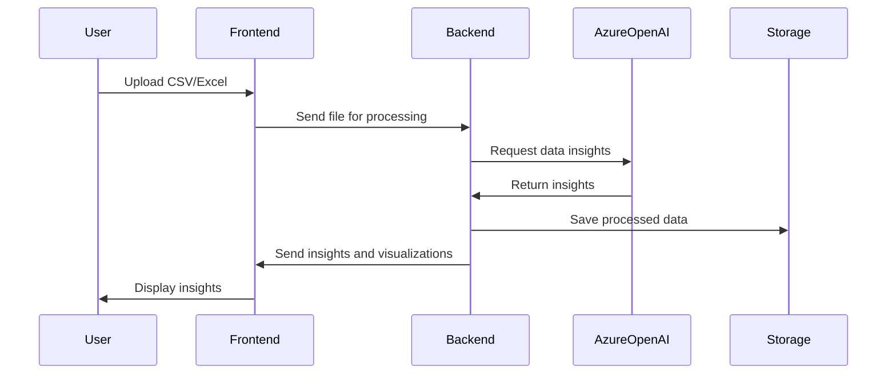

# Architecture Document Template

## 🧱 System Overview
DataSage is a web-based AI-powered data exploration tool designed to simplify the interaction with tabular data through natural language processing. The system is built using a modern tech stack that includes Next.js and React for the frontend, FastAPI for the backend, and Azure services for AI integration and storage. The architecture is designed to be modular, scalable, and efficient, leveraging Azure OpenAI for natural language processing and PostgreSQL for structured data storage. The integration of these components allows for seamless data upload, querying, and visualization, providing users with an intuitive and powerful data exploration experience.

---

## 📦 Directory Structure (Simplified)
```plaintext
DataSage/
├── frontend/                      # Frontend application
│   ├── components/                # Reusable React components
│   ├── pages/                     # Next.js pages
│   ├── styles/                    # CSS and styling files
│   ├── utils/                     # Utility functions and helpers
│   └── public/                    # Static assets
├── backend/                       # Backend application
│   ├── api/                       # FastAPI endpoints
│   ├── models/                    # Database models
│   ├── services/                  # Business logic and services
│   └── utils/                     # Utility functions and helpers
├── infrastructure/                # Infrastructure as code
│   ├── azure/                     # Azure deployment scripts
│   └── docker/                    # Docker configurations
├── docs/                          # Documentation
│   ├── AGENTS.md                  # Agent roster and prompt responsibilities
│   ├── PRD.md                     # Product vision, scope, and goals
│   ├── TASK-LOG.json              # Completed tasks (append-only history)
│   ├── PROPOSED-TASKS.md          # Future or suggested system-generated work
│   └── ARCHITECTURE.md            # Technical implementation guide and prompt interface contract
└── tests/                         # Testing suite
    ├── frontend/                  # Frontend tests
    └── backend/                   # Backend tests
```

---

## 🧱 Codex Infrastructure Files Explained
- `AGENTS.md`: Agent roster and prompt responsibilities
- `PRD.md`: Product vision, scope, and goals
- `TASK-LOG.json`: Completed tasks (append-only history)
- `PROPOSED-TASKS.md`: Future or suggested system-generated work
- `ARCHITECTURE.md`: Technical implementation guide and prompt interface contract

---

## 🤖 Agent I/O Conventions
Clarify how agents exchange information using markdown. Mention formatting rules, metadata expectations, and give an example entry for `TASK-LOG.json`.

### Key Conventions
- Markdown format required
- Output should target a single `.codex/` file
- Task Metadata must include agent, task id, date, summary, and output files

### Example: `TASK-LOG.json` Entry
```json
{
  "task_id": "task-999",
  "agent": "frontend_specialist",
  "date": "2025-06-25",
  "summary": "Added support for generating JSON-based task logs and rendering them in dashboard.",
  "output_files": ["apps/techcat-studio/src/app/dashboard/page.tsx"]
}
```

---

## 🧠 Agent Orchestration Principles
- Agents are stateless; they rely on `TASK-LOG.json` for inferred memory
- Prompts are scoped to a single goal
- Agent chaining via `Once complete, invoke task_logger`
- Output is written to `.codex/` and reflected in UI where needed

---

## 💃 Storage & Data Flows

### Markdown-First Architecture
- Local-first by design for `.codex/`
- `.md` files act as both human- and LLM-readable data

### Storage Evolution
```markdown
| Stage    | Mechanism                                                    |
|----------|--------------------------------------------------------------|
| MVP      | Markdown + Azure Blob Storage                                |
| Post-MVP | PostgreSQL (structured feedback) + GitHub file sync          |
```

---

## 📡 APIs & External Services

### Used APIs
- Azure OpenAI for natural language processing
- Azure Blob Storage for file storage
- PostgreSQL for structured data management

### Optional Backend
- Integration with additional data sources like Airtable and Google Sheets for extended data handling capabilities.

---

## 🖥 Frontend Technology Stack
| Tool     | Purpose                                      |
|----------|----------------------------------------------|
| Next.js  | Server-side rendering and static site generation |
| React    | Building user interfaces                     |
| CSS/SCSS | Styling components and layout                |

---

## 🔄 File Generation Lifecycle


---

## ✅ Best Practices
- Ensure modularity and separation of concerns in codebase
- Maintain comprehensive documentation for all components
- Implement robust error handling and logging
- Optimize AI resource usage to manage costs effectively
- Regularly update dependencies and security patches

---

## 🚧 Future Engineering Notes
- Explore integration of additional AI models for enhanced data processing
- Consider implementing a plugin system for third-party data source integration
- Investigate advanced caching strategies to improve performance
- Plan for scalability to handle larger datasets and more concurrent users

---