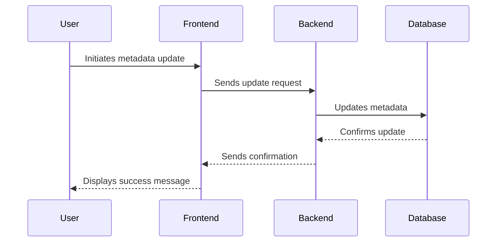

# Architecture Document Template

## 🧱 System Overview
Lakeforge is architected as a comprehensive solution for metadata-driven data ingestion within the Databricks ecosystem. The system is designed to leverage Databricks' Lakebase for database management, Next.js for the frontend, and Python FastAPI for the backend API. The architecture is modular, allowing for seamless integration and scalability. The main components include:

- **Frontend**: Built with Next.js, providing a responsive and interactive UI for managing metadata and data ingestion processes.
- **Backend**: Implemented using Python FastAPI, offering robust API endpoints for data operations and metadata management.
- **Database**: Utilizes Databricks Lakebase, a Postgres-based OLTP database, to store and manage metadata configurations and ingestion rules.
- **Hosting**: Entirely hosted within Databricks Apps, ensuring a cohesive and integrated user experience.
- **Model Serving**: Utilizes Databricks Model Serving Endpoints for any AI-driven insights or automation features.

The integration between these components is facilitated through RESTful APIs, ensuring efficient communication and data exchange.

---

## 📦 Directory Structure (Simplified)
```plaintext
lakeforge/
├── frontend/                     # Next.js frontend application
│   ├── components/               # Reusable UI components
│   ├── pages/                    # Next.js pages
│   ├── styles/                   # CSS and styling files
│   └── utils/                    # Utility functions and helpers
├── backend/                      # FastAPI backend application
│   ├── api/                      # API endpoint definitions
│   ├── models/                   # Database models and schemas
│   ├── services/                 # Business logic and service layer
│   └── utils/                    # Utility functions and helpers
├── database/                     # Database configuration and scripts
│   └── migrations/               # Database migration files
├── .codex/                       # Codex infrastructure files
│   ├── AGENTS.md                 # Agent roster and prompt responsibilities
│   ├── PRD.md                    # Product vision, scope, and goals
│   ├── TASK-LOG.json             # Completed tasks (append-only history)
│   ├── PROPOSED-TASKS.md         # Future or suggested system-generated work
│   └── ARCHITECTURE.md           # Technical implementation guide and prompt interface contract
└── README.md                     # Project overview and setup instructions
```

---

## 🧱 Codex Infrastructure Files Explained
- `AGENTS.md`: Agent roster and prompt responsibilities
- `PRD.md`: Product vision, scope, and goals
- `TASK-LOG.json`: Completed tasks (append-only history)
- `PROPOSED-TASKS.md`: Future or suggested system-generated work
- `ARCHITECTURE.md`: Technical implementation guide and prompt interface contract

---

## 🤖 Agent I/O Conventions
Clarify how agents exchange information using markdown. Mention formatting rules, metadata expectations, and give an example entry for `TASK-LOG.json`.

### Key Conventions
- Markdown format required
- Output should target a single `.codex/` file
- Task Metadata must include agent, task id, date, summary, and output files

### Example: `TASK-LOG.json` Entry
```json
{
  "task_id": "task-999",
  "agent": "frontend_specialist",
  "date": "2025-06-25",
  "summary": "Added support for generating JSON-based task logs and rendering them in dashboard.",
  "output_files": ["apps/techcat-studio/src/app/dashboard/page.tsx"]
}
```

---

## 🧠 Agent Orchestration Principles
- Agents are stateless; they rely on `TASK-LOG.json` for inferred memory
- Prompts are scoped to a single goal
- Agent chaining via `Once complete, invoke task_logger`
- Output is written to `.codex/` and reflected in UI where needed

---

## 💃 Storage & Data Flows

### Markdown-First Architecture
- Local-first by design for `.codex/`
- `.md` files act as both human- and LLM-readable data

### Storage Evolution
```markdown
| Stage    | Mechanism                                                    |
|----------|--------------------------------------------------------------|
| MVP      | Markdown + Databricks Lakebase                               |
| Post-MVP | PostgreSQL (structured feedback) + GitHub file sync          |
```

---

## 📡 APIs & External Services

### Used APIs
- Databricks REST API for data operations
- FastAPI for backend services
- Databricks Model Serving Endpoints for AI-driven insights

### Optional Backend
- Integration with external logging services for enhanced monitoring
- Optional use of Redis for caching frequently accessed metadata

---

## 🖥 Frontend Technology Stack
| Tool     | Purpose                                    |
|----------|--------------------------------------------|
| React    | Building interactive UI components         |
| Next.js  | Server-side rendering and routing          |
| CSS/SCSS | Styling and layout management              |

---

## 🔄 File Generation Lifecycle


---

## ✅ Best Practices
- Maintain clear and concise documentation for all components
- Ensure consistent coding standards across frontend and backend
- Regularly update and review `TASK-LOG.json` for task tracking
- Implement comprehensive testing for all API endpoints

---

## 🚧 Future Engineering Notes
- Explore integration with additional Databricks features as they become available
- Consider implementing a more robust caching mechanism for metadata retrieval
- Evaluate the potential for expanding AI-driven insights and automation features
- Plan for scalability and performance optimization as user adoption grows

---