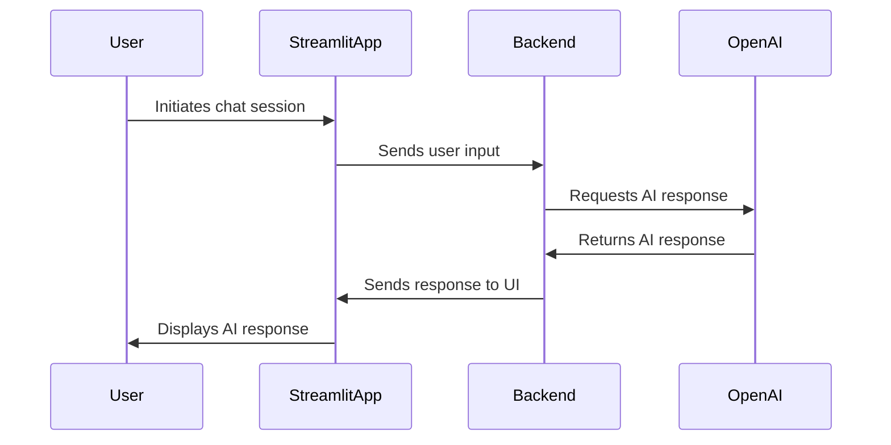

# Architecture Document Template

## 🧱 System Overview
The `streamlit-chatbot-app` is designed to integrate OpenAI's conversational AI capabilities within a Streamlit application framework. The architecture consists of several key components:

- **Frontend**: Built using Streamlit, providing a simple yet powerful interface for users to interact with the AI. Streamlit's reactive nature ensures that any changes in the backend are immediately reflected in the UI.
- **Backend**: Developed in Python, the backend handles API requests to OpenAI, processes user inputs, and manages session data. It acts as the intermediary between the user interface and the AI service.
- **AI Integration**: Utilizes the OpenAI API to generate responses based on user inputs. The integration is designed to be flexible, allowing for customizable responses and potential future enhancements like multi-language support.
- **Deployment**: Docker is used for containerization, ensuring consistent environments across development, testing, and production. Heroku is chosen for deployment due to its ease of use and scalability.

The components are tightly integrated, with Streamlit serving as the primary interface layer, Python managing the logic and API interactions, and Docker/Heroku ensuring smooth deployment and scaling.

---

## 📦 Directory Structure (Simplified)
```plaintext
streamlit-chatbot-app/
├── .docker/                      # Docker configuration files
├── .streamlit/                   # Streamlit configuration files
├── app/
│   ├── __init__.py               # Initialize the app module
│   ├── main.py                   # Main entry point for the Streamlit app
│   ├── session_manager.py        # Handles session management and storage
│   └── utils.py                  # Utility functions for the app
├── requirements.txt              # Python dependencies
├── Dockerfile                    # Dockerfile for containerization
├── README.md                     # Project documentation
└── tests/
    ├── test_main.py              # Unit tests for main app functionality
    └── test_utils.py             # Unit tests for utility functions
```

---

## 🧱 Codex Infrastructure Files Explained
- `AGENTS.md`: Agent roster and prompt responsibilities
- `PRD.md`: Product vision, scope, and goals
- `TASK-LOG.json`: Completed tasks (append-only history)
- `PROPOSED-TASKS.md`: Future or suggested system-generated work
- `ARCHITECTURE.md`: Technical implementation guide and prompt interface contract

---

## 🤖 Agent I/O Conventions
Clarify how agents exchange information using markdown. Mention formatting rules, metadata expectations, and give an example entry for `TASK-LOG.json`.

### Key Conventions
- Markdown format required
- Output should target a single `.codex/` file
- Task Metadata must include agent, task id, date, summary, and output files

### Example: `TASK-LOG.json` Entry
```json
{
  "task_id": "task-999",
  "agent": "frontend_specialist",
  "date": "2025-06-25",
  "summary": "Added support for generating JSON-based task logs and rendering them in dashboard.",
  "output_files": ["apps/techcat-studio/src/app/dashboard/page.tsx"]
}
```

---

## 🧠 Agent Orchestration Principles
- Agents are stateless; they rely on `TASK-LOG.json` for inferred memory
- Prompts are scoped to a single goal
- Agent chaining via `Once complete, invoke task_logger`
- Output is written to `.codex/` and reflected in UI where needed

---

## 💃 Storage & Data Flows

### Markdown-First Architecture
- Local-first by design for `.codex/`
- `.md` files act as both human- and LLM-readable data

### Storage Evolution
```markdown
| Stage    | Mechanism                                                    |
|----------|--------------------------------------------------------------|
| MVP      | Markdown + Local Storage                                     |
| Post-MVP | PostgreSQL (structured feedback) + GitHub file sync          |
```

---

## 📡 APIs & External Services

### Used APIs
- OpenAI API for conversational AI capabilities

### Optional Backend
- Consider integrating a lightweight backend using Flask or FastAPI for more complex data processing or additional API integrations.

---

## 🖥 Frontend Technology Stack
| Tool      | Purpose                                                    |
|-----------|------------------------------------------------------------|
| Streamlit | Provides the main user interface for interacting with the AI|

---

## 🔄 File Generation Lifecycle


---

## ✅ Best Practices
- Maintain clear and concise documentation for all components.
- Ensure consistent coding standards and style across the project.
- Regularly update dependencies and monitor for security vulnerabilities.
- Implement comprehensive testing to cover all critical functionalities.
- Use version control effectively to manage changes and collaborate.

---

## 🚧 Future Engineering Notes
- Explore the integration of voice interaction capabilities for enhanced accessibility.
- Consider implementing an analytics dashboard to provide insights into user interactions.
- Plan for scalability by evaluating cloud-based solutions for deployment.
- Continuously gather user feedback to inform future feature development and improvements.