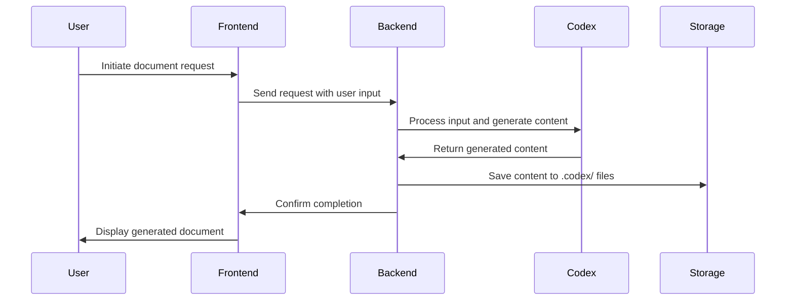

# Architecture Document Template

## 🧱 System Overview
TechCat Studio is designed as a web-based platform that leverages AI to streamline software development processes. The architecture is composed of a React and Next.js frontend for a dynamic and responsive user interface, while the backend is powered by FastAPI to handle API requests and business logic. The system integrates with OpenAI's Codex for AI functionalities and uses PostgreSQL for data storage. Deployment is managed on Azure, ensuring scalability and reliability. The integration with GitHub facilitates version control and collaboration.

---

## 📦 Directory Structure (Simplified)
The directory structure is organized to separate concerns and maintain clarity. Below is a simplified view:

```plaintext
TechCat-Studio/
├── apps/
│   ├── techcat-studio/
│   │   ├── src/
│   │   │   ├── app/
│   │   │   │   ├── components/        # Reusable React components
│   │   │   │   ├── pages/             # Next.js pages for routing
│   │   │   │   ├── styles/            # CSS and styling files
│   │   │   │   ├── utils/             # Utility functions and helpers
│   │   │   ├── public/                # Static files such as images
│   │   ├── backend/
│   │   │   ├── api/                   # FastAPI endpoints
│   │   │   ├── models/                # Database models
│   │   │   ├── services/              # Business logic and services
│   │   │   ├── tests/                 # Backend tests
├── .codex/                            # Codex infrastructure files
│   ├── AGENTS.md                      # Agent roster and prompt responsibilities
│   ├── PRD.md                         # Product vision, scope, and goals
│   ├── TASK-LOG.json                  # Completed tasks (append-only history)
│   ├── PROPOSED-TASKS.md              # Future or suggested system-generated work
│   ├── ARCHITECTURE.md                # Technical implementation guide and prompt interface contract
├── config/                            # Configuration files
├── scripts/                           # Deployment and maintenance scripts
├── docs/                              # Documentation and guides
```

---

## 🧱 Codex Infrastructure Files Explained
- `AGENTS.md`: Agent roster and prompt responsibilities
- `PRD.md`: Product vision, scope, and goals
- `TASK-LOG.json`: Completed tasks (append-only history)
- `PROPOSED-TASKS.md`: Future or suggested system-generated work
- `ARCHITECTURE.md`: Technical implementation guide and prompt interface contract

---

## 🤖 Agent I/O Conventions
Clarify how agents exchange information using markdown. Mention formatting rules, metadata expectations, and give an example entry for `TASK-LOG.json`.

### Key Conventions
- Markdown format required
- Output should target a single `.codex/` file
- Task Metadata must include agent, task id, date, summary, and output files

### Example: `TASK-LOG.json` Entry
```json
{
  "task_id": "task-999",
  "agent": "frontend_specialist",
  "date": "2025-06-25",
  "summary": "Added support for generating JSON-based task logs and rendering them in dashboard.",
  "output_files": ["apps/techcat-studio/src/app/dashboard/page.tsx"]
}
```

---

## 🧠 Agent Orchestration Principles
- Agents are stateless; they rely on `TASK-LOG.json` for inferred memory
- Prompts are scoped to a single goal
- Agent chaining via `Once complete, invoke task_logger`
- Output is written to `.codex/` and reflected in UI where needed

---

## 💃 Storage & Data Flows

### Markdown-First Architecture
- Local-first by design for `.codex/`
- `.md` files act as both human- and LLM-readable data

### Storage Evolution
```markdown
| Stage    | Mechanism                                                    |
|----------|--------------------------------------------------------------|
| MVP      | Markdown + Airtable                                          |
| Post-MVP | PostgreSQL (structured feedback) + GitHub file sync          |
```

---

## 📡 APIs & External Services

### Used APIs
- OpenAI Codex for AI functionalities
- GitHub API for version control and collaboration

### Optional Backend
- Redis for caching to improve performance
- RabbitMQ for task queue management

---

## 🖥 Frontend Technology Stack
| Tool     | Purpose                                      |
|----------|----------------------------------------------|
| React    | Building dynamic user interfaces             |
| Next.js  | Server-side rendering and routing            |
| Tailwind CSS | Styling and responsive design            |
| Axios    | Handling HTTP requests to backend services   |

---

## 🔄 File Generation Lifecycle


---

## ✅ Best Practices
- Maintain clear and concise documentation for all agent tasks
- Ensure consistent use of markdown for all `.codex/` files
- Regularly update `TASK-LOG.json` to reflect completed tasks
- Use version control for all changes to infrastructure files

---

## 🚧 Future Engineering Notes
- Explore integration with additional AI models for enhanced capabilities
- Consider implementing a microservices architecture for scalability
- Evaluate the use of Kubernetes for container orchestration
- Investigate additional security measures for user data protection

---